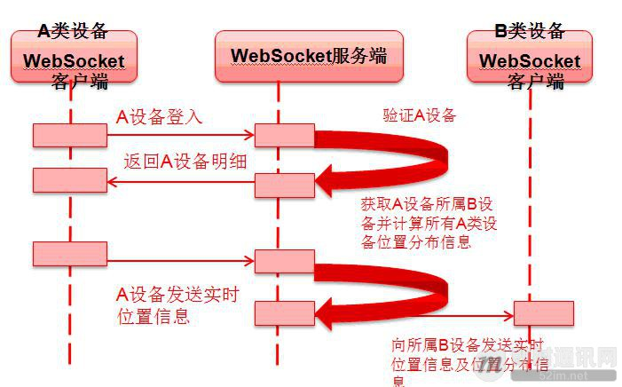

# 案例分析
http://www.52im.net/thread-326-1-1.html
## 1.案例介绍
- 该客户为一个移动设备制造商，移动设备装载的是 Android/IOS 操作系统，设备分两类（以下简称 A，B 两类），A 类设备随时处于移动状态中，B 类设备为 A 类设备的管理控制设备，客户需要随时在 B 类设备中看到所属 A 类设备的地理位置信息及状态信息。如 A 类设备上线，离线的时候，B 类设备需要立即获得消息通知，A 类设备上报时，B 类设备也需要实时获得该上报 A 类设备的地理位置信息。
- 为降低跨平台的难度及实施工作量，客户考虑轻量级的 Web App 的方式屏蔽 Android/IOS 平台的差异性，A 类设备数量众多，且在工作状态下 A 类设备处于不定时的移动状态，而 B 类设备对 A 类设备状态变化的感知实时性要求很高（秒级）。
- 根据以上需求，A/B 类设备信息存放在后台数据库中，A/B 类设备的交互涉及 Web 客户端/服务器频繁和高并发的请求-相应，如果使用传统的 HTTP 请求-响应模式，B 类设备的 Web App 上需要对服务进行轮询，势必会对服务器带来大的负载压力，且当 A 类设备没有上线或者上报等活动事件时，B 类设备的轮询严重浪费网络资源。
# 解决方案
- 综上所述，项目采用 WebSocket 技术实现实时消息的通知及推送，每当 A 类设备/B 类设备上线登录成功即打开 WebSocket 的 HTTP 长连接，新的 A 类设备上线，位置变化，离线等状态变化通过 WebSocket 发送实时消息，WebSocket Server 端处理 A 类设备的实时消息，并向所从属的 B 类设备实时推送。
- WebSocket 客户端使用 jQuery Mobile（jQuery Mobile 移动端开发在本文中不再详细描述，感兴趣的读者可以参考jQuery Mobile 简介)，使用原生 WebSocket API 实现与服务端交互。
- 服务端沿用客户已有的应用服务器 Tomcat 7.0.33 版本，使用 Apache 自定义 API 实现 WebSocket Server 端，为一个上线的 A 类设备生成一个 WebSocket 的 HTTP 长连接，每当 A 类设备有上线，位置更新，离线等事件的时候，客户端发送文本消息，服务端识别并处理后，向所属 B 类设备发送实时消息，B 类设备客户端接收消息后，识别到 A 类设备的相应事件，完成对应的 A 类设备位置刷新以及其他业务操作。
- 其涉及的 A 类设备，B 类设备及后台服务器交互时序图如下。
A/B 类设备 WebSocket 交互图：

- A/B 类设备的 WebSocket 客户端封装在 websocket.js 的 JavaScript 代码中，与 jQuery MobileApp 一同打包为移动端 apk/ipa 安装包；WebSocket 服务端实现主要为 WebSocketDeviceServlet.java, WebSocketDeviceInbound.java，WebSocketDeviceInboundPool.java 几个类。下文我们一一介绍其具体代码实现。